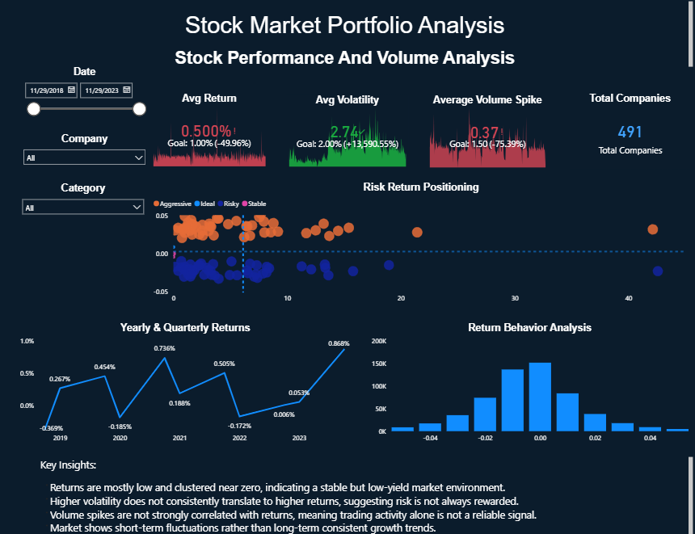
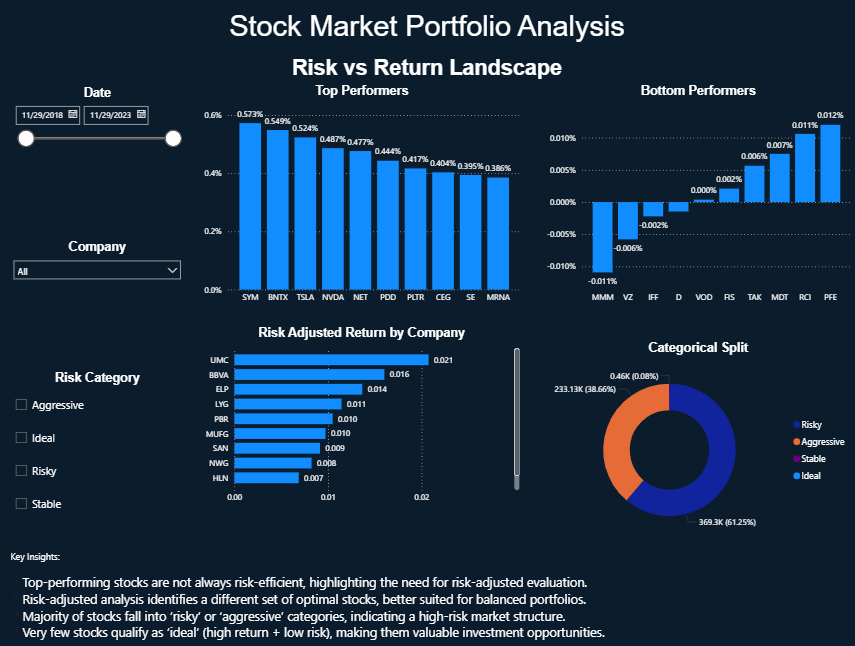
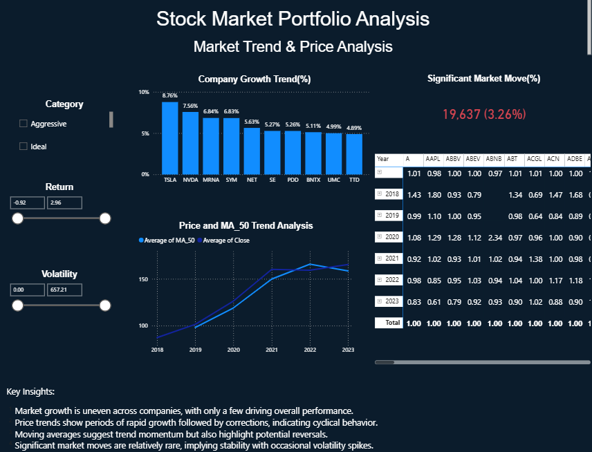
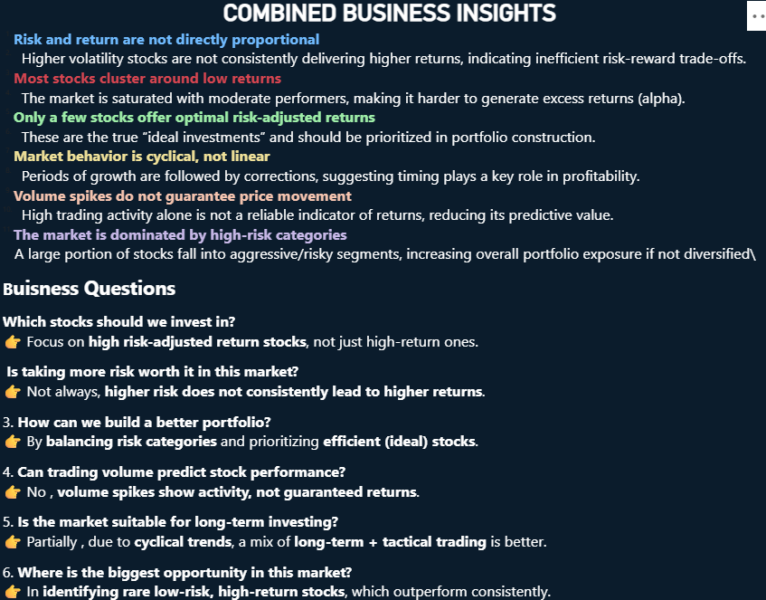

# 📈 Stock Market Analysis (Yahoo Finance Data)
Conducted stock market analysis using Python, SQL, and Power BI to evaluate trends, volatility, and returns. Applied time-series techniques and visualizations to compare performance across stocks and derive insights for investment and risk assessment

## 📌 Business Problem  
Investors struggle to interpret large-scale stock data to identify profitable and stable investment opportunities. This project analyzes historical stock data to uncover performance trends, volatility patterns, and risk-return relationships for smarter decision-making.

---

## 🎯 Objective  
- Analyze stock price trends from 2018–2023  
- Identify high-return and low-risk stocks  
- Understand volatility and trading behavior  
- Enable data-driven investment insights  

---

## 🛠 Tools & Their Usage  

### 🔹 Python (Pandas, NumPy, Matplotlib, Seaborn)
- Data cleaning and preprocessing  
- Feature engineering (Returns, Volatility, Moving Averages)  
- Time-series and distribution analysis  
- Visualization of trends and relationships  

### 🔹 SQL  
- Identification of top-performing stocks using **average returns**  
- Risk analysis using **volatility (standard deviation of returns)**  
- Detection of strong market movements using **volume spikes (>1.5x)**  
- Filtering balanced stocks using:
  - Return > **1%**
  - Volatility < **2.5%**  

### 🔹 Power BI  
- Interactive dashboard for performance tracking  
- Risk vs return visualization  
- Market trend and stock comparison analysis  

---

## 📊 Dataset  
- Source: Yahoo Finance (Kaggle)  
- Period: **2018 – 2023**  
- Data includes: Open, Close, High, Low, Volume, Dividends  

---

## 📊 Key Insights  

### 📈 Market Trends
- Stock prices show **clear trend cycles with periodic corrections**  
- Long-term trends are more reliable than short-term fluctuations  

---

### 📊 Volatility Analysis
- Volatility calculated using **20-day rolling standard deviation**  
- Stocks with higher returns consistently exhibit **higher volatility**  

---

### 💰 Returns Analysis
- Daily returns calculated using percentage change  
- Significant movements defined as **>2% daily return**  
- Moving averages (20-day) help identify trend direction  

---

### ⚖️ Risk vs Return
- Positive relationship observed between **return and volatility**  
- Stocks with:
  - Return > **1%**
  - Volatility < **2.5%**  
  → Identified as **balanced investment opportunities**  

---

### 🔥 Volume-Based Insights
- Volume spikes defined as **>1.5x average trading volume**  
- Strong price movements often occur when:
  - Volume Spike > **1.5**
  - Return > **2%**  
- Indicates **high market participation / institutional activity**  

---

### 📊 Consistency Analysis
- Stable stocks identified using:
  - Positive average return  
  - Low standard deviation (<2%)  
- Useful for long-term portfolio construction  

---

## ⚠️ Challenges & Solutions  

### 🔹 High Market Noise  
→ Solved using rolling averages and smoothing  

### 🔹 Multi-stock Comparison  
→ Standardized metrics (Return, Volatility)  

### 🔹 Identifying Meaningful Signals  
→ Combined filters (Return + Volume + Risk thresholds)  

---

## 🚀 Business Impact  
- Helps identify **high-return vs low-risk stocks**  
- Supports **portfolio diversification decisions**  
- Enables detection of **high-confidence market movements**  
- Converts raw stock data into **actionable investment insights**  

---

## 📂 Project Structure  
- `Data/` → dataset (external due to size)  
- `Notebook/` → Python EDA  
- `SQL_Queries/` → analytical queries  
- `Dashboard/` → Power BI dashboard  
- `Images/` → visual outputs  

---

## 📊 Dataset Link  
https://www.kaggle.com/datasets/suruchiarora/yahoo-finance-dataset-2018-2023  

---

## 📊 Power BI Dashboard  
👉 https://drive.google.com/file/d/140POxWZjUVCPR0-IEuWF_-iF6gl815z_/view?usp=drive_link  

---

## 📸 Dashboard Preview  

 
### Performance Analysis  

### Risk vs Return  

### Market Trends  

### Business Insights  

